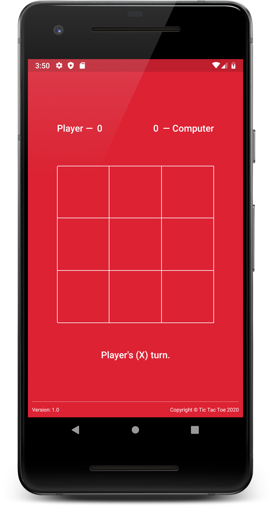
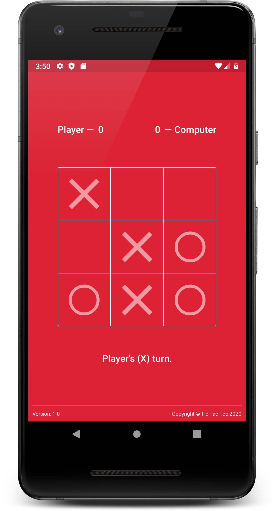
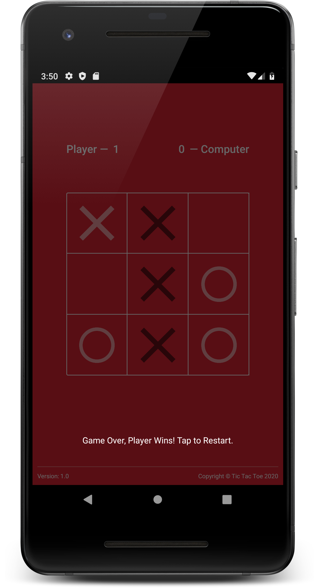

# Tic-Tac-Toe 

#### A simple Tic-Tac-Toe game against Computer based on Minimax AI Algorithm!

#### Minimax AI Algorithm:

Assuming Player X has to make his/her move, then the logic based on Minimax AI Algorithm will be as follows:

- If the game is over, return the score from X's perspective.
- Otherwise get a list of new game states for every possible move
- Create a scores list
- For each of these states add the minimax result of that state to the scores list
- If it's X's turn, return the maximum score from the scores list
- If it's O's turn, return the minimum score from the scores list

#### App Install Link:

#### Features:

- Plain and simple game
- No Ads or Pop-Up or Subscription

#### Roadmap:

- AI Engine to be Updated

#### Screenshots:

#### Author

- Gokul Nath KP
